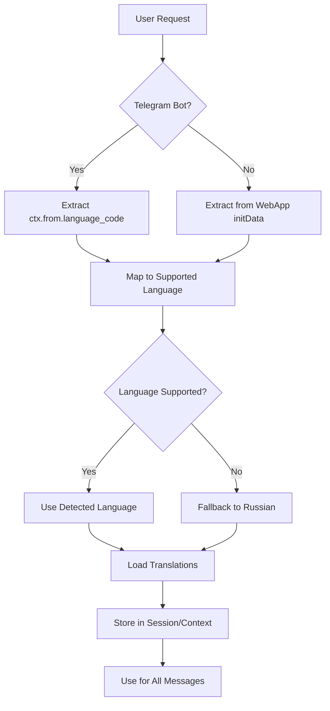

# Internationalization (i18n) Implementation Guide

This document describes the multi-language support implementation for WhereTo, covering both Telegram Bot and Mini App (Angular/Ionic).

> **Reference**: This i18n implementation supports the specifications in [`docs/FINAL-SPEC.md`](FINAL-SPEC.md). For the canonical implementation-ready specification, see FINAL-SPEC.md.

## Overview

WhereTo supports multiple languages with automatic detection from Telegram user settings. Translations are stored as JSON files in the codebase for version control and easy maintenance.

### Supported Languages

- **Russian (ru)** - Default language
- **English (en)**
- **Romanian (ro)**
- **Extensible** - Architecture supports adding additional languages easily

### Key Principles

1. **Automatic Detection**: Language is detected from Telegram user settings (`language_code`)
2. **Versioned Translations**: All translations stored in JSON files in codebase
3. **Type-Safe**: TypeScript types for translation keys
4. **Fallback Strategy**: Falls back to Russian if language not supported or translation missing
5. **Client-Side**: Most i18n happens in Bot/Mini App, API is language-agnostic

## Architecture

### Translation File Structure

```
libs/shared/src/i18n/
├── translations/
│   ├── ru.json          # Russian translations
│   ├── en.json          # English translations
│   ├── ro.json          # Romanian translations
│   └── index.ts         # Export all translations
├── types.ts             # TypeScript types for translation keys
├── language-detector.ts # Language detection utilities
└── translation.service.ts # Translation service (shared)
```

### Language Detection Flow



## Translation Key Structure

### Naming Convention

- **Namespaced by component**: `bot.*`, `app.*`, `merchant.*`
- **Grouped by feature**: `bot.plan.*`, `bot.venue.*`, `app.search.*`
- **Consistent naming**: 
  - Verbs in present tense: `save`, `cancel`, `join`
  - Nouns lowercase: `venue`, `plan`, `city`
  - Actions: `save`, `saved`, `saving`

### Example Structure

```json
{
  "bot": {
    "start": {
      "welcome": "Привет! В каком городе ищем места?",
      "selectCity": "Выбери город"
    },
    "venue": {
      "card": {
        "title": "{name}",
        "rating": "⭐ {rating} ({count})",
        "save": "❤️ Сохранить",
        "saved": "✅ Сохранено",
        "route": "📍 Маршрут",
        "call": "📞 Позвонить",
        "website": "🌐 Сайт",
        "share": "🔗 Поделиться",
        "back": "⬅️ Назад к списку"
      }
    },
    "plan": {
      "create": {
        "when": "Когда?",
        "time": "Во сколько?",
        "area": "Район?",
        "budget": "Бюджет?",
        "format": "Формат?",
        "votingDuration": "Сколько времени голосуем?"
      },
      "created": "План создан: {date} {time}, {area}, бюджет {budget}, формат {format}. Нажми Join, чтобы участвовать.",
      "join": "Join",
      "preferences": "Мои предпочтения",
      "showOptions": "Показать варианты",
      "cancel": "Отменить"
    },
    "errors": {
      "notFound": "Ничего не нашёл по запросу. Попробуй другое слово или выбери категорию.",
      "generic": "Что-то пошло не так. Попробуй ещё раз через секунду.",
      "venueNotFound": "Место не найдено."
    }
  },
  "app": {
    "venue": {
      "card": {
        "title": "Venue Details",
        "openInMaps": "Open in Maps",
        "requestBooking": "Request Booking"
      }
    }
  }
}
```

### Interpolation

Use curly braces for dynamic content:

```json
{
  "bot": {
    "plan": {
      "created": "План создан: {date} {time}, {area}, бюджет {budget}, формат {format}.",
      "winner": "Победитель: **{venue}** ({votes} голосов)"
    }
  }
}
```

### Pluralization

Handle plural forms using ICU message format or custom logic:

```json
{
  "bot": {
    "plan": {
      "participants": {
        "one": "{count} участник",
        "few": "{count} участника",
        "many": "{count} участников",
        "other": "{count} участников"
      }
    }
  }
}
```

## Bot Implementation (Telegraf)

### Language Detection

```typescript
// libs/shared/src/i18n/language-detector.ts
export type SupportedLanguage = 'ru' | 'en' | 'ro';

const LANGUAGE_MAP: Record<string, SupportedLanguage> = {
  'ru': 'ru',
  'en': 'en',
  'ro': 'ro',
  'ru-RU': 'ru',
  'en-US': 'en',
  'en-GB': 'en',
  'ro-RO': 'ro',
};

export function detectLanguage(telegramLanguageCode?: string): SupportedLanguage {
  if (!telegramLanguageCode) {
    return 'ru'; // Default fallback
  }
  
  // Try exact match
  if (LANGUAGE_MAP[telegramLanguageCode]) {
    return LANGUAGE_MAP[telegramLanguageCode];
  }
  
  // Try language code only (e.g., 'ru' from 'ru-RU')
  const langCode = telegramLanguageCode.split('-')[0];
  if (LANGUAGE_MAP[langCode]) {
    return LANGUAGE_MAP[langCode];
  }
  
  return 'ru'; // Default fallback
}
```

### Translation Service

```typescript
// libs/shared/src/i18n/translation.service.ts
import { readFileSync } from 'fs';
import { join } from 'path';
import { SupportedLanguage, detectLanguage } from './language-detector';

type TranslationKey = string;
type TranslationParams = Record<string, string | number>;

class TranslationService {
  private translations: Map<SupportedLanguage, Record<string, any>> = new Map();
  
  constructor() {
    // Load all translation files
    ['ru', 'en', 'ro'].forEach(lang => {
      const translations = JSON.parse(
        readFileSync(join(__dirname, 'translations', `${lang}.json`), 'utf-8')
      );
      this.translations.set(lang as SupportedLanguage, translations);
    });
  }
  
  t(key: TranslationKey, params?: TranslationParams, lang?: SupportedLanguage): string {
    const language = lang || 'ru';
    const translations = this.translations.get(language) || this.translations.get('ru')!;
    
    // Navigate nested object (e.g., 'bot.start.welcome')
    const keys = key.split('.');
    let value: any = translations;
    
    for (const k of keys) {
      value = value?.[k];
      if (value === undefined) {
        // Fallback to Russian if key not found
        const ruTranslations = this.translations.get('ru')!;
        value = ruTranslations;
        for (const rk of keys) {
          value = value?.[rk];
          if (value === undefined) {
            return key; // Return key if not found even in fallback
          }
        }
        break;
      }
    }
    
    // Interpolate parameters
    if (typeof value === 'string' && params) {
      return value.replace(/\{(\w+)\}/g, (match, paramKey) => {
        return params[paramKey]?.toString() || match;
      });
    }
    
    return value || key;
  }
  
  getLanguage(ctx: any): SupportedLanguage {
    return detectLanguage(ctx.from?.language_code);
  }
}

export const translationService = new TranslationService();
```

### Bot Handler Example

```typescript
// apps/bot/src/handlers/start.handler.ts
import { Context } from 'telegraf';
import { translationService } from '@whereto/shared/i18n';

export class StartHandler {
  async handle(ctx: Context): Promise<void> {
    const lang = translationService.getLanguage(ctx);
    
    const welcome = translationService.t('bot.start.welcome', {}, lang);
    const selectCity = translationService.t('bot.start.selectCity', {}, lang);
    
    await ctx.reply(welcome, {
      reply_markup: {
        inline_keyboard: [
          [{ text: 'Kishinev', callback_data: 'city:kishinev' }],
        ],
      },
    });
  }
}
```

### Bot Handler with Interpolation

```typescript
// apps/bot/src/handlers/plan.handler.ts
import { Context } from 'telegraf';
import { translationService } from '@whereto/shared/i18n';

export class PlanHandler {
  async handlePlanCreated(ctx: Context, plan: Plan): Promise<void> {
    const lang = translationService.getLanguage(ctx);
    
    const message = translationService.t(
      'bot.plan.created',
      {
        date: plan.date,
        time: plan.time,
        area: plan.area,
        budget: plan.budget,
        format: plan.format,
      },
      lang
    );
    
    await ctx.reply(message, {
      reply_markup: {
        inline_keyboard: [
          [
            { text: translationService.t('bot.plan.join', {}, lang), callback_data: 'plan:join' },
            { text: translationService.t('bot.plan.preferences', {}, lang), callback_data: 'plan:prefs' },
          ],
        ],
      },
    });
  }
}
```

### Session-Based Language Storage

```typescript
// apps/bot/src/middleware/language.middleware.ts
import { MiddlewareFn } from 'telegraf';
import { translationService } from '@whereto/shared/i18n';
import { SupportedLanguage } from '@whereto/shared/i18n';

export const languageMiddleware: MiddlewareFn<any> = async (ctx, next) => {
  // Detect language from Telegram user settings
  const detectedLang = translationService.getLanguage(ctx);
  
  // Store in session (or use detected if session doesn't have override)
  if (!ctx.session.language) {
    ctx.session.language = detectedLang;
  }
  
  // Make translation function available in context
  ctx.t = (key: string, params?: Record<string, string | number>) => {
    return translationService.t(key, params, ctx.session.language);
  };
  
  return next();
};
```

## Mini App Implementation (Angular/Ionic)

### Setup with @ngx-translate

```typescript
// apps/miniapp/src/app/app.module.ts
import { NgModule } from '@angular/core';
import { HttpClient, HttpClientModule } from '@angular/common/http';
import { TranslateModule, TranslateLoader } from '@ngx-translate/core';
import { TranslateHttpLoader } from '@ngx-translate/http-loader';

export function HttpLoaderFactory(http: HttpClient) {
  return new TranslateHttpLoader(http, './assets/i18n/', '.json');
}

@NgModule({
  imports: [
    HttpClientModule,
    TranslateModule.forRoot({
      loader: {
        provide: TranslateLoader,
        useFactory: HttpLoaderFactory,
        deps: [HttpClient],
      },
      defaultLanguage: 'ru',
    }),
  ],
})
export class AppModule {}
```

### Language Detection from Telegram WebApp

```typescript
// apps/miniapp/src/app/services/telegram-i18n.service.ts
import { Injectable } from '@angular/core';
import { TranslateService } from '@ngx-translate/core';
import { TelegramWebApp } from '@twa-dev/types';

@Injectable({
  providedIn: 'root',
})
export class TelegramI18nService {
  constructor(private translate: TranslateService) {}
  
  initialize(): void {
    // Get Telegram WebApp instance
    const tg = (window as any).Telegram?.WebApp;
    
    if (tg?.initDataUnsafe?.user?.language_code) {
      const telegramLang = tg.initDataUnsafe.user.language_code;
      const mappedLang = this.mapTelegramLanguage(telegramLang);
      this.translate.use(mappedLang);
    } else {
      this.translate.use('ru'); // Default fallback
    }
  }
  
  private mapTelegramLanguage(telegramLang: string): string {
    const langMap: Record<string, string> = {
      'ru': 'ru',
      'en': 'en',
      'ro': 'ro',
    };
    
    // Try exact match
    if (langMap[telegramLang]) {
      return langMap[telegramLang];
    }
    
    // Try language code only
    const langCode = telegramLang.split('-')[0];
    return langMap[langCode] || 'ru';
  }
}
```

### Component Usage

```typescript
// apps/miniapp/src/app/pages/venue-detail/venue-detail.page.ts
import { Component } from '@angular/core';
import { TranslateService } from '@ngx-translate/core';

@Component({
  selector: 'app-venue-detail',
  templateUrl: './venue-detail.page.html',
})
export class VenueDetailPage {
  constructor(private translate: TranslateService) {}
  
  getSaveButtonText(): string {
    return this.translate.instant('app.venue.card.save');
  }
  
  getFormattedMessage(venue: Venue): string {
    return this.translate.instant('app.venue.card.title', { name: venue.name });
  }
}
```

```html
<!-- apps/miniapp/src/app/pages/venue-detail/venue-detail.page.html -->
<ion-content>
  <ion-card>
    <ion-card-header>
      <ion-card-title>{{ 'app.venue.card.title' | translate: { name: venue.name } }}</ion-card-title>
    </ion-card-header>
    <ion-card-content>
      <p>{{ 'app.venue.card.rating' | translate: { rating: venue.rating, count: venue.ratingCount } }}</p>
      <ion-button>
        {{ 'app.venue.card.save' | translate }}
      </ion-button>
    </ion-card-content>
  </ion-card>
</ion-content>
```

### Translation Files for Mini App

Store translations in `apps/miniapp/src/assets/i18n/`:

```
apps/miniapp/src/assets/i18n/
├── ru.json
├── en.json
└── ro.json
```

## Date and Time Formatting

### Per-Locale Formatting

```typescript
// libs/shared/src/i18n/date-formatter.ts
import { SupportedLanguage } from './language-detector';

const LOCALE_MAP: Record<SupportedLanguage, string> = {
  'ru': 'ru-RU',
  'en': 'en-US',
  'ro': 'ro-RO',
};

export function formatDate(date: Date, lang: SupportedLanguage): string {
  const locale = LOCALE_MAP[lang];
  return new Intl.DateTimeFormat(locale, {
    year: 'numeric',
    month: 'long',
    day: 'numeric',
  }).format(date);
}

export function formatTime(time: Date, lang: SupportedLanguage): string {
  const locale = LOCALE_MAP[lang];
  return new Intl.DateTimeFormat(locale, {
    hour: '2-digit',
    minute: '2-digit',
  }).format(time);
}
```

## Number Formatting

```typescript
// libs/shared/src/i18n/number-formatter.ts
import { SupportedLanguage } from './language-detector';

const LOCALE_MAP: Record<SupportedLanguage, string> = {
  'ru': 'ru-RU',
  'en': 'en-US',
  'ro': 'ro-RO',
};

export function formatNumber(num: number, lang: SupportedLanguage): string {
  const locale = LOCALE_MAP[lang];
  return new Intl.NumberFormat(locale).format(num);
}

export function formatDistance(meters: number, lang: SupportedLanguage): string {
  const locale = LOCALE_MAP[lang];
  
  if (meters < 1000) {
    return `${meters} ${lang === 'ru' ? 'м' : lang === 'ro' ? 'm' : 'm'}`;
  }
  
  const km = meters / 1000;
  return `${km.toFixed(1)} ${lang === 'ru' ? 'км' : 'km'}`;
}
```

## Type-Safe Translation Keys

### Generate Types from Translation Files

```typescript
// libs/shared/src/i18n/types.ts
// This file can be auto-generated from translation JSON files

export type TranslationKey =
  | 'bot.start.welcome'
  | 'bot.start.selectCity'
  | 'bot.venue.card.title'
  | 'bot.venue.card.save'
  | 'bot.venue.card.saved'
  | 'bot.plan.created'
  | 'bot.plan.join'
  | 'bot.errors.notFound'
  // ... more keys
  ;

// Helper type for nested keys
type NestedKeyOf<ObjectType extends object> = {
  [Key in keyof ObjectType & (string | number)]: ObjectType[Key] extends object
    ? `${Key}` | `${Key}.${NestedKeyOf<ObjectType[Key]>}`
    : `${Key}`;
}[keyof ObjectType & (string | number)];

// Usage in translation service
export function t(key: TranslationKey, params?: Record<string, string | number>): string {
  // Implementation
}
```

## Best Practices

### 1. Keep Translations Context-Aware

- Use specific keys: `bot.venue.card.save` instead of generic `save`
- Group related translations: `bot.plan.*` for all plan-related strings

### 2. Avoid Hardcoded Strings

- Always use translation keys, even for emojis if they vary by language
- Extract all user-facing strings to translation files

### 3. Use Interpolation for Dynamic Content

```typescript
// Good
translationService.t('bot.plan.winner', { venue: venueName, votes: voteCount }, lang);

// Bad - don't concatenate
translationService.t('bot.plan.winner', {}, lang) + ' ' + venueName;
```

### 4. Handle Pluralization Correctly

- Use ICU message format or custom pluralization logic
- Test with different numbers (0, 1, 2, 5, 11, etc.)

### 5. Test with Different Languages

- Test all flows in all supported languages
- Check for text overflow (some languages are longer)
- Verify date/time/number formatting

### 6. Missing Translation Monitoring

```typescript
// Add logging for missing translations in development
if (process.env.NODE_ENV === 'development') {
  if (translation === key) {
    console.warn(`Missing translation: ${key} for language: ${lang}`);
  }
}
```

### 7. Translation Review Process

- Have native speakers review translations
- Test in real user scenarios
- Update translations based on user feedback

## Adding a New Language

### Step 1: Create Translation File

Create `libs/shared/src/i18n/translations/{lang}.json` with all translation keys.

### Step 2: Update Language Detector

```typescript
// libs/shared/src/i18n/language-detector.ts
export type SupportedLanguage = 'ru' | 'en' | 'ro' | 'de'; // Add new language

const LANGUAGE_MAP: Record<string, SupportedLanguage> = {
  // ... existing mappings
  'de': 'de',
  'de-DE': 'de',
};
```

### Step 3: Update Locale Maps

Update date and number formatter locale maps.

### Step 4: Test

Test all flows in the new language.

## Adding New Translation Keys

### Step 1: Add to All Language Files

Add the key to `ru.json`, `en.json`, and `ro.json`:

```json
{
  "bot": {
    "newFeature": {
      "title": "New Feature Title"
    }
  }
}
```

### Step 2: Update TypeScript Types

Add the key to `types.ts` (or regenerate if using code generation).

### Step 3: Use in Code

```typescript
const title = translationService.t('bot.newFeature.title', {}, lang);
```

## Testing

### Testing Different Languages

```typescript
// tests/bot/handlers/start.handler.spec.ts
describe('StartHandler', () => {
  it('should use Russian by default', async () => {
    const ctx = createMockContext({ language_code: undefined });
    await handler.handle(ctx);
    expect(ctx.reply).toHaveBeenCalledWith(
      expect.stringContaining('Привет')
    );
  });
  
  it('should use English when user language is en', async () => {
    const ctx = createMockContext({ language_code: 'en' });
    await handler.handle(ctx);
    expect(ctx.reply).toHaveBeenCalledWith(
      expect.stringContaining('Hello')
    );
  });
});
```

### Translation Coverage Testing

Create a test that verifies all keys exist in all languages:

```typescript
// tests/i18n/translation-coverage.spec.ts
describe('Translation Coverage', () => {
  it('should have all keys in all languages', () => {
    const ruKeys = getAllKeys(ruTranslations);
    const enKeys = getAllKeys(enTranslations);
    const roKeys = getAllKeys(roTranslations);
    
    expect(enKeys).toEqual(ruKeys);
    expect(roKeys).toEqual(ruKeys);
  });
});
```

## Migration Strategy

### Migrating Existing Hardcoded Strings

1. **Extract strings from Bot-Copy-RU.md**
   - Create translation keys for all bot messages
   - Add to `ru.json` first
   - Translate to `en.json` and `ro.json`

2. **Update Bot Handlers**
   - Replace hardcoded strings with `translationService.t()` calls
   - Add language detection middleware

3. **Update Mini App Components**
   - Replace hardcoded strings with `translate` pipe
   - Initialize language detection on app startup

4. **Test Thoroughly**
   - Test all flows in all languages
   - Verify no hardcoded strings remain

## API Considerations

The API is generally language-agnostic. However, if needed:

### Optional Language Parameter

```typescript
// API can accept optional language parameter for error messages
GET /api/v1/venues?lang=ru

// Or via Accept-Language header
Accept-Language: ru-RU,ru;q=0.9,en;q=0.8
```

Most i18n happens client-side (Bot/Mini App), so API language support is optional.

## References

- See [`docs/TECH-STACK.md`](TECH-STACK.md) for framework-specific i18n patterns
- See [`docs/Bot-Copy-RU.md`](Bot-Copy-RU.md) for Russian copy reference
- See [`docs/FINAL-SPEC.md`](FINAL-SPEC.md) for product specifications

